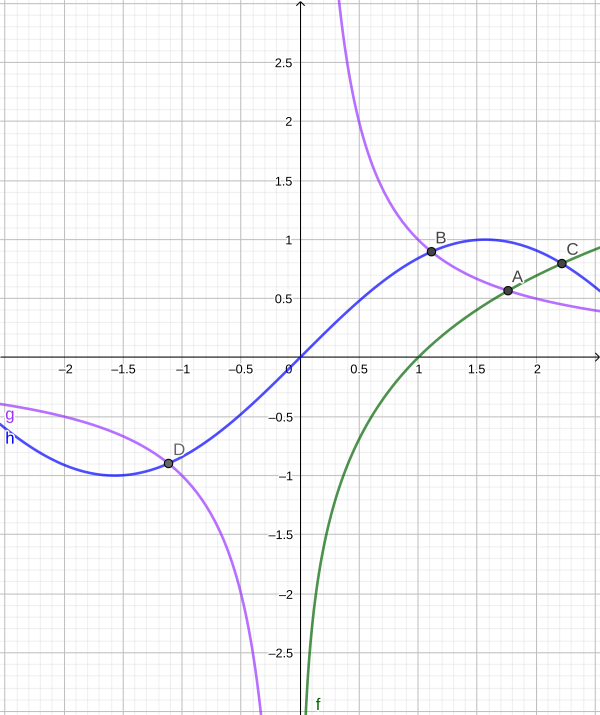
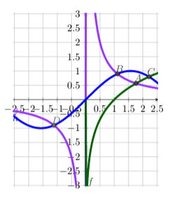

# Tidy GeoGebra TikZ Outputs

This project aims to tidy GeoGebra TikZ outputs to more readable form.

### Why?

GeoGebra graphs can be exported to TikZ. While this feature saves time spent manually coding plotting code in LaTeX, the exported TikZ code is cluttered with long floats, and most of the labels end up in inappropriate positions. For example, consider this plot:



TikZ code generated by GeoGebra looks like this:

```latex
\documentclass[10pt]{article}
\usepackage{pgfplots}
\pgfplotsset{compat=1.15}
\usepackage{mathrsfs}
\usetikzlibrary{arrows}
\pagestyle{empty}
\begin{document}
\definecolor{wwwwww}{rgb}{0.4,0.4,0.4}
\definecolor{qqqqff}{rgb}{0,0,1}
\definecolor{uuuuuu}{rgb}{0.26666666666666666,0.26666666666666666,0.26666666666666666}
\definecolor{qqwuqq}{rgb}{0,0.39215686274509803,0}
\definecolor{zzttff}{rgb}{0.6,0.2,1}
\begin{tikzpicture}[line cap=round,line join=round,>=triangle 45,x=1cm,y=1cm]
\begin{axis}[
x=1cm,y=1cm,
axis lines=middle,
ymajorgrids=true,
xmajorgrids=true,
xmin=-2.542222222222222,
xmax=2.542222222222222,
ymin=-3.031111111111107,
ymax=3.0311111111111044,
xtick={-2.5,-2,...,2.5},
ytick={-3,-2.5,...,3},]
\clip(-2.542222222222222,-3.031111111111107) rectangle (2.542222222222222,3.0311111111111044);
\draw[line width=2pt,color=zzttff,smooth,samples=100,domain=-2.542222222222222:2.542222222222222] plot(\x,{1/(\x)});
\draw[line width=2pt,color=qqwuqq,smooth,samples=100,domain=1.1230708203691098e-15:2.542222222222222] plot(\x,{ln((\x))});
\draw[line width=2pt,color=qqqqff,smooth,samples=100,domain=-2.542222222222222:2.542222222222222] plot(\x,{sin(((\x))*180/pi)});
\begin{scriptsize}
\draw[color=zzttff] (-2.4622222222222225,-0.422222222222223) node {$g$};
\draw[color=qqwuqq] (0.1688888888888889,-2.8844444444444406) node {$f$};
\draw [fill=uuuuuu] (1.7632228342332446,0.5671432904479485) circle (2pt);
\draw[color=uuuuuu] (1.8311111111111111,0.7422222222222195) node {$A$};
\draw[color=qqqqff] (-2.4622222222222225,-0.6266666666666671) node {$h$};
\draw [fill=uuuuuu] (1.1141571379594095,0.897539463626747) circle (2pt);
\draw[color=uuuuuu] (1.1822222222222223,1.0711111111111078) node {$B$};
\draw [fill=uuuuuu] (2.219107148913697,0.7971049298120292) circle (2pt);
\draw[color=uuuuuu] (2.293333333333333,0.97333333333333) node {$C$};
\draw [fill=wwwwww] (-1.1141571408719257,-0.8975394612804907) circle (2pt);
\draw[color=wwwwww] (-1.04,-0.7244444444444447) node {$D$};
\end{scriptsize}
\end{axis}
\end{tikzpicture}
\end{document}
```

The code above renders as this:



The labels are too close to the graphs and points (in my point of view), and the code is hard to read because of the floats and lack of indentation.

## Project Goals

- Automatically tidy LaTeX code
- Round floats to make the code more readable
- Use standard LaTeX colors rather than GeoGebra-defined colors
- Move labels to more readable positions